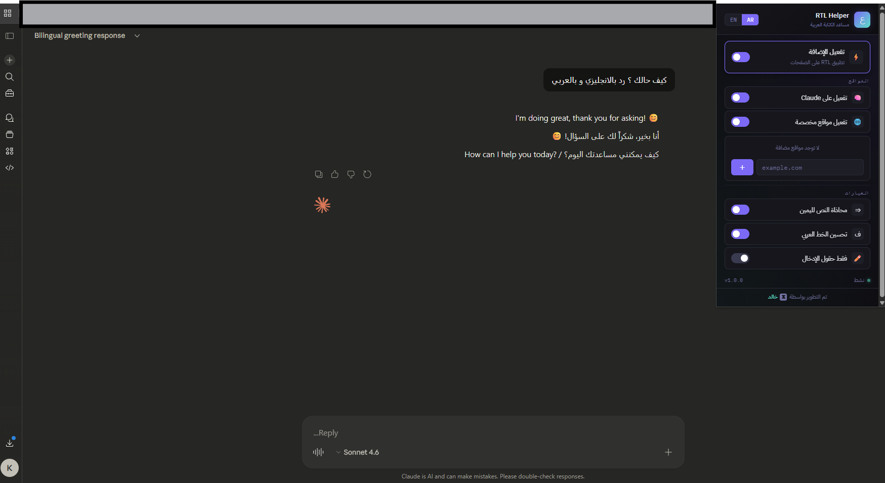

<div align="center">


<h1>RTL Helper</h1>

<p>A lightweight Chrome extension that brings proper RTL support and Arabic readability to Claude and any custom website — with a clean bilingual UI.</p>

<br/>


</div>

---

## ✨ Overview

**RTL Helper** fixes the frustrating experience of reading or writing Arabic on AI platforms and other LTR-first websites. It injects clean RTL styles into the page, aligns text properly, improves Arabic font rendering, and applies to any custom site you configure — all from a polished dark popup.

> Built by [Khalid](https://x.com/REMiX_KSA)

---

## 🖥️ Preview

> _The extension popup — dark theme with bilingual support_



---

## ⚡ Features

| Feature | Description |
|---|---|
| 🧠 **Claude Support** | Enabled by default — RTL applied automatically on `claude.ai` |
| 🌐 **Custom Sites** | Add unlimited domains to apply RTL to any website |
| ⇒ **Force Right Align** | Overrides text alignment for Arabic content |
| ف **Arabic Font** | Switches to a cleaner Arabic-friendly font stack |
| ✏️ **Inputs Only Mode** | Apply RTL exclusively to text input fields |
| 🌍 **Bilingual UI** | Full Arabic / English interface with one click |
| ⚡ **Master Toggle** | Enable or disable everything instantly |
| 🔒 **No tracking** | Zero analytics, zero external requests, no data collected |

---

## 📦 Installation

Since this extension is not published on the Chrome Web Store, install it manually in **Developer Mode**:

```
1. Download or clone this repository
2. Open Chrome and navigate to:  chrome://extensions/
3. Enable "Developer mode" (top-right toggle)
4. Click "Load unpacked"
5. Select the folder containing this project
```

> ✅ The extension icon will appear in your Chrome toolbar immediately.

---

## 🗂️ File Structure

```
rtl-helper/
├── manifest.json       # Extension config (Manifest V3)
├── background.js       # Service worker — sets default settings on install
├── content.js          # Injected into target pages — applies RTL classes
├── styles.css          # RTL styles injected into web pages
├── popup.html          # Extension popup UI
├── popup.js            # Popup logic — settings, language, storage
├── popup.css           # Popup styles — dark theme
├── icon16.png          # Toolbar icon
├── icon32.png
├── icon48.png
└── icon128.png         # Store / extension page icon
```

---

## ⚙️ How It Works

```
User opens Claude (or a custom site)
        │
        ▼
content.js checks chrome.storage.sync
        │
        ├─ enabled? ──────────────── No  ──▶ Remove all RTL classes
        │
        ├─ claude.ai + claudeEnabled ──▶ Apply RTL
        │
        └─ customEnabled + host match ──▶ Apply RTL
                │
                ▼
        Injects CSS classes on <body>:
        .khalid-rtl
        .khalid-force-right
        .khalid-arabic-font
        .khalid-inputs-only
```

---

## 🛠️ Settings Reference

| Setting | Default | Description |
|---|---|---|
| `enabled` | `true` | Master on/off switch |
| `claudeEnabled` | `true` | Apply RTL on `claude.ai` |
| `customEnabled` | `false` | Apply RTL on custom domains |
| `customSites` | `[]` | Array of custom domain patterns |
| `forceTextAlignRight` | `true` | Force `text-align: right` on content |
| `improveArabicFont` | `true` | Use Segoe UI / Tahoma font stack |
| `targetInputsOnly` | `false` | Only affect text inputs, not full page |
| `lang` | `"ar"` | UI language (`ar` or `en`) |

Settings are persisted via `chrome.storage.sync` and sync across Chrome profiles.

---

## 🌐 Supported Sites

By default, RTL Helper is active on:

- ✅ `claude.ai` — enabled out of the box
- ➕ Any site you add via the **custom sites** panel in the popup

---

## 📋 Permissions

| Permission | Why |
|---|---|
| `storage` | Save and sync your settings across Chrome sessions |
| `host_permissions: https://*/*` | Required to inject content scripts into custom sites |

> No browsing history, no data collection, no remote servers.

---

## 🧩 Compatibility


- Manifest V3 compliant
- No external libraries or dependencies
- Works on Chrome 88+ and all Chromium-based browsers (Edge, Brave, Arc, etc.)

---

## 👤 Author

<div align="center">

**Khalid**

[](https://x.com/REMiX_KSA)
[](https://routers.world)

</div>

---

## 📄 License

```
MIT License — feel free to use, fork, and modify.
```

---

<div align="center">
<sub>Made with ♥ for the Arabic-speaking developer community</sub>
</div>
